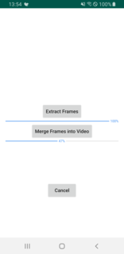

# AndroidVideoTranscoder           

Surprisingly fast on device video transcoding.

Features

- extracting images from video either ffmpeg or mediacodec
- creating video from image seither ffmpeg or mediacodec

# How to use

### Extracting frames

 	FFMpegTranscoder.extractFramesFromVideo(
 			context = application, 
 			frameTimes = times, 
 			inputVideo = inputVideo, 
 			id = "12345", 
 			outputDir = frameFolder
 		)
   		.subscribeOn(Schedulers.io())
   		.observeOn(AndroidSchedulers.mainThread())
   		.subscribe(
        	{ logv { "extract frames ${it.progress} ${it.message} ${(it.duration / 1000f).roundToInt()} s" } },
	      	{ logv { "extracting frames failed ${it.message}" }}, 
        	{ logv { "extracting frames successfully completed" } }
        )
        .addTo(subscription)
        
### Merging frames to create video

    FFMpegTranscoder.createVideoFromFrames(
        	context = application,
        	frameFolder = frameFolder,
        	outputUri = outputVideo,
        	config = EncodingConfig(
            	sourceFrameRate = 30 // every source image is a frame
        	)
      	)
        .subscribeOn(Schedulers.io())
        .observeOn(AndroidSchedulers.mainThread())
        .subscribe(
        	{ logv { "merging frames ${it.progress} ${it.message} ${(it.duration / 1000f).roundToInt()} s" } },
	      	{ logv { "merging frames to create a video failed ${it.message}" }}, 
        	{ logv { "video creation successfully completed" } }
        )
        .addTo(subscription)
        

# How to install

Step 1. Add the JitPack repository to your build file

Add it in your root build.gradle at the end of repositories:

	allprojects {
		repositories {
			...
			maven { url 'https://dl.bintray.com/exozetag/maven' }
		}
	}
Step 2. Add the dependency

	dependencies {
		implementation 'com.exozet:transcoder:{version}'
	}

### License
<pre>
Copyright 2019 Exozet GmbH

Licensed under the Apache License, Version 2.0 (the "License");
you may not use this file except in compliance with the License.
You may obtain a copy of the License at

http://www.apache.org/licenses/LICENSE-2.0

Unless required by applicable law or agreed to in writing, software
distributed under the License is distributed on an "AS IS" BASIS,
WITHOUT WARRANTIES OR CONDITIONS OF ANY KIND, either express or implied.
See the License for the specific language governing permissions and
limitations under the License.
</pre>
